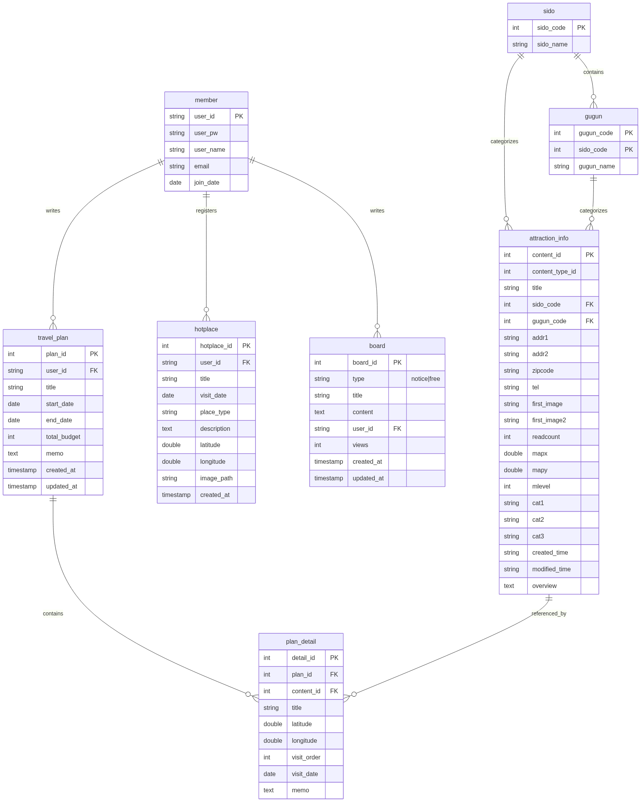

# EnjoyTrip

Java MVC 기반 국내 여행 정보 공유 플랫폼입니다.  
공공데이터포털 관광 API와 카카오맵 API를 활용하여 관광지 조회, 여행계획 수립, 핫플레이스 공유, 게시판 기능을 제공합니다.

---

## 기술 스택

| 구분 | 기술 |
|------|------|
| Backend | Java 17, Jakarta Servlet 6 (Tomcat 11) |
| Frontend | JSP, JSTL (jakarta.tags.core), HTML5, CSS3, Vanilla JS |
| Database | MySQL 8 (Docker) |
| Map | Kakao Maps JavaScript API |
| 관광 데이터 | 공공데이터포털 한국관광공사 KorService2 API |
| Build | Maven |
| IDE | Eclipse STS |

---

## 주요 기능

### F101~103 · 지역별 관광지 조회
- 시/도 → 구/군 → 분류 선택 후 관광지 검색
- 카카오맵에 마커 표시, 마우스오버 시 미니 정보 카드
- 목록 패널에서 카드 클릭 시 해당 마커로 이동
- 관광지 상세 페이지 (이미지·주소·전화·개요)

### F104 · 나의 여행계획
- 시/도·구군·분류로 관광지 검색 후 방문지 추가
- 드래그앤드롭으로 방문 순서 변경
- 계획 목록 / 상세 / 수정 / 삭제

### F105 · 핫플레이스
- 회원이 직접 장소 등록 (제목·분류·방문일·설명·좌표)
- 카카오맵에 등록된 핫플레이스 마커 표시
- 목록 / 상세 / 수정 / 삭제

### F106 · 게시판
- 공지사항 (notice) / 자유게시판 (free) 탭 분리
- 글쓰기·수정·삭제 (작성자 본인만 가능)
- 조회수 자동 증가

### F107~108 · 회원관리 / 로그인관리
- 회원가입 / 로그인 / 로그아웃
- 마이페이지 (정보 수정 / 회원 탈퇴)
- 세션 기반 인증 (`loginUser` 세션 키)

---

## 프로젝트 구조

```
EnjoyTrip/
├── src/com/enjoytrip/
│   ├── attraction/          # 관광지 (F101~103)
│   │   ├── controller/AttractionController.java   @WebServlet("/attraction/*")
│   │   ├── dao/             AttractionDao / AttractionDaoImpl
│   │   ├── service/         AttractionService / AttractionServiceImpl
│   │   └── dto/             AttractionInfo, Sido, Gugun
│   ├── plan/                # 여행계획 (F104)
│   │   ├── controller/PlanController.java         @WebServlet("/plan/*")
│   │   ├── dao/             TravelPlanDao / TravelPlanDaoImpl
│   │   ├── service/         TravelPlanService / TravelPlanServiceImpl
│   │   └── dto/             TravelPlan, PlanDetail
│   ├── hotplace/            # 핫플레이스 (F105)
│   │   ├── controller/HotplaceController.java     @WebServlet("/hotplace/*")
│   │   ├── dao/             HotplaceDao / HotplaceDaoImpl
│   │   ├── service/         HotplaceService / HotplaceServiceImpl
│   │   └── dto/             Hotplace
│   ├── board/               # 게시판 (F106)
│   │   ├── controller/BoardController.java        @WebServlet("/board/*")
│   │   ├── dao/             BoardDao / BoardDaoImpl
│   │   ├── service/         BoardService / BoardServiceImpl
│   │   └── dto/             Board
│   ├── member/              # 회원관리 (F107~108)
│   │   ├── controller/MemberController.java       @WebServlet("/user/*")
│   │   ├── dao/             MemberDao / MemberDaoImpl
│   │   ├── service/         MemberService / MemberServiceImpl
│   │   └── dto/             Member
│   └── util/DBUtil.java
│
├── WebContent/
│   └── WEB-INF/views/
│       ├── common/          header.jsp, footer.jsp
│       ├── attraction/      list.jsp, detail.jsp
│       ├── plan/            list.jsp, write.jsp, detail.jsp, modify.jsp
│       ├── hotplace/        list.jsp, write.jsp, detail.jsp, modify.jsp
│       ├── board/           list.jsp, write.jsp, detail.jsp, modify.jsp
│       └── member/          login.jsp, join.jsp, mypage.jsp, modify.jsp
│
└── sql/schema.sql
```

---

## DB 테이블

| 테이블 | 설명 |
|--------|------|
| `member` | 회원 (userId PK) |
| `sido` | 광역시/도 코드 |
| `gugun` | 구/군 코드 |
| `attraction_info` | 관광지 정보 (contentId PK) |
| `travel_plan` | 여행계획 헤더 |
| `plan_detail` | 여행계획 상세 (방문지 목록) |
| `hotplace` | 핫플레이스 |
| `board` | 게시판 (type: notice \| free) |

---

## 환경 설정 및 실행

### 1. Docker Compose 실행 (MySQL DB 및 스키마 적용)

```bash
docker-compose up -d
```
> `docker-compose.yml`에 의해 **3305 포트**로 MySQL이 실행되며, `sql/schema.sql` 스키마가 자동으로 적용됩니다.

### 2. MySQL CLI 접속 (선택 사항)

실행 중인 MySQL 컨테이너에 직접 접속하려면 다음 명령어를 사용하세요.
```bash
docker compose exec mysql mysql -ussafy -pssafy --default-character-set=utf8mb4 enjoytrip
```

### 3. DBUtil 설정 확인

[DBUtil.java](src/com/enjoytrip/util/DBUtil.java) — JDBC URL / 계정 확인

```
URL  : jdbc:mysql://localhost:3305/enjoytrip?serverTimezone=UTC&useUniCode=yes&characterEncoding=UTF-8
User : ssafy
Pass : ssafy
```

### 4. STS / Eclipse 실행

1. Maven Update Project (`Alt+F5`)
2. Tomcat 11 서버에 프로젝트 추가
3. Start Server → `http://localhost:8080/EnjoyTrip/`

---

## API 키

| 서비스 | 키 위치 |
|--------|---------|
| 카카오맵 | `header.jsp` / `write.jsp` 내 `appkey` |
| 공공데이터포털 | `web.xml` 내 `kakaoJavascriptKey` |

---

## 주요 설계 포인트

- **CORS 우회**: 브라우저에서 `apis.data.go.kr`를 직접 호출하면 CORS 에러 발생  
  → `AttractionController`가 Java `HttpURLConnection`으로 프록시 처리  
  → 프론트엔드는 `/attraction/api/sido`, `/attraction/api/gugun`, `/attraction/api/search` 호출

- **JSP EL 충돌 방지**: JavaScript 내 `${변수}` 사용 금지 (JSP EL로 파싱됨)  
  → 모든 동적 HTML 생성은 `var x = '...' + variable` 문자열 연결 방식 사용

- **세션 인증**: `HttpSession` 의 `loginUser` (userId 문자열) 로 로그인 상태 판별


# EnjoyTrip ERD

`sql/schema.sql` 파일을 바탕으로 작성된 데이터베이스 스키마 구조입니다.



## 테이블 상세 설명

1.  **member (회원)**: 사용자 계정 정보를 관리합니다.
2.  **sido (시도)**: 지역 코드(광역시/도)를 관리합니다.
3.  **gugun (구군)**: 시도에 속한 하위 행정구역 코드를 관리합니다.
4.  **attraction_info (관광지 정보)**: 공공데이터 API로부터 가져온 관광지 상세 정보를 저장합니다.
5.  **travel_plan (여행 계획)**: 사용자가 생성한 여행 계획의 마스터 정보입니다.
6.  **plan_detail (여행 계획 상세)**: 여행 계획에 포함된 개별 방문지 정보를 저장합니다.
7.  **hotplace (핫플레이스)**: 사용자가 직접 등록한 추천 장소 정보입니다.
8.  **board (게시판)**: 공지사항 및 자유게시판 게시글을 관리합니다.
