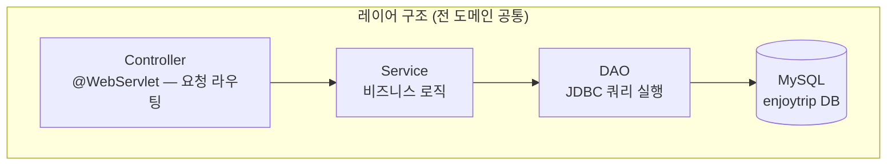
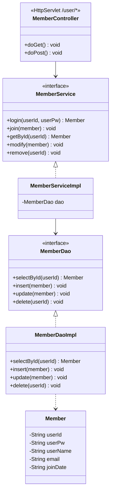
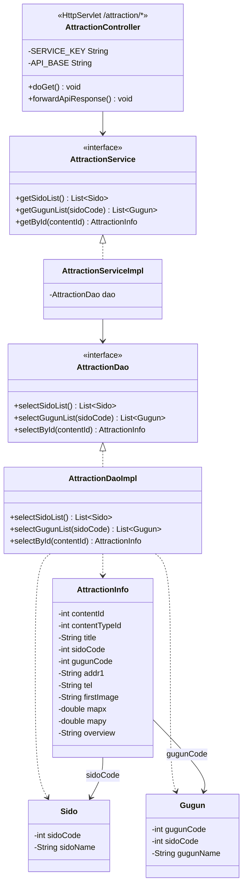
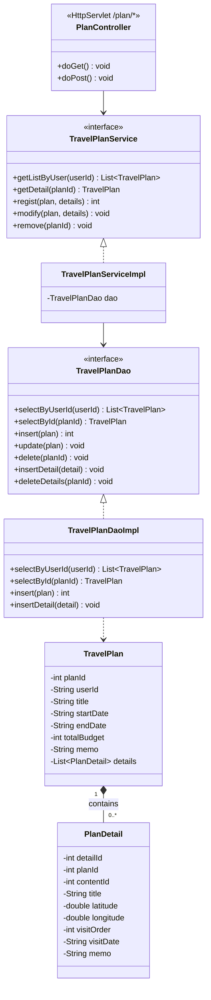
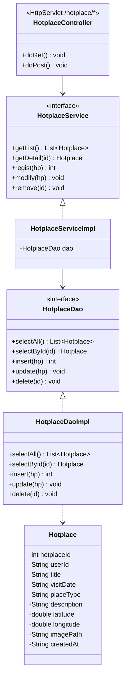
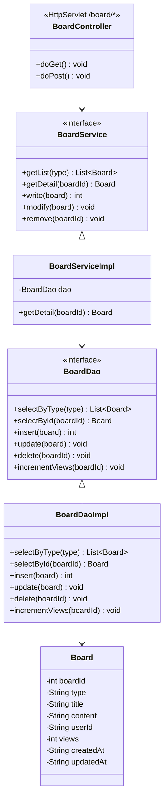

# EnjoyTrip 클래스 다이어그램

도메인별로 분리한 클래스 다이어그램입니다.

---

## 그림 1 · 레이어 구조

---

## 그림 2 · 회원 도메인 (F107~108)

---

## 그림 3 · 관광지 도메인 (F101~103)

---

## 그림 4 · 여행계획 도메인 (F104)

---

## 그림 5 · 핫플레이스 도메인 (F105)

---

## 그림 6 · 게시판 도메인 (F106)

---

## 도메인별 클래스 목록

| 도메인 | Controller | Service | DAO | DTO |
|--------|-----------|---------|-----|-----|
| 회원 | `MemberController` | `MemberService` | `MemberDao` | `Member` |
| 관광지 | `AttractionController` | `AttractionService` | `AttractionDao` | `AttractionInfo`, `Sido`, `Gugun` |
| 여행계획 | `PlanController` | `TravelPlanService` | `TravelPlanDao` | `TravelPlan`, `PlanDetail` |
| 핫플레이스 | `HotplaceController` | `HotplaceService` | `HotplaceDao` | `Hotplace` |
| 게시판 | `BoardController` | `BoardService` | `BoardDao` | `Board` |
| 공통 유틸 | — | — | `DBUtil` | — |
