# EnjoyTrip v2 Use Case Diagram

## 1. Actors

| Actor | 설명 |
|-------|------|
| 일반 사용자 | 관광지 조회, 여행계획 작성, Hotplace 등록, 게시판 이용, 회원 기능을 사용하는 사용자 |
| Admin | 공지사항 관리와 전체 게시글 관리 권한을 가진 관리자 |

## 2. Use Case Diagram

```mermaid
flowchart LR
    User["일반 사용자"]
    Admin["Admin"]

    subgraph System["<<SystemBoundary>> EnjoyTrip v2"]
        UC01(("회원가입"))
        UC02(("로그인"))
        UC03(("로그아웃"))
        UC04(("비밀번호 찾기"))
        UC05(("회원정보 조회"))
        UC06(("회원정보 수정"))
        UC07(("회원 탈퇴"))

        UC10(("지역별 관광지 조회"))
        UC11(("컨텐츠별 관광지 조회"))
        UC12(("관광지 상세 보기"))
        UC13(("Kakao Map에서 관광지 확인"))

        UC20(("여행계획 생성"))
        UC21(("여행계획 조회"))
        UC22(("여행계획 수정"))
        UC23(("여행계획 삭제"))
        UC24(("관광지를 여행계획에 추가"))
        UC25(("방문 순서 변경"))
        UC26(("여행 경로 지도 보기"))
        UC27(("여행 기간 날씨 보기"))
        UC28(("내 여행계획 포함 여부 확인"))

        UC30(("Hotplace 등록"))
        UC31(("Hotplace 조회"))
        UC32(("Hotplace 수정"))
        UC33(("Hotplace 삭제"))
        UC34(("관광지 상세의 Hotplace 후기 보기"))
        UC35(("사진 업로드"))
        UC36(("지도 좌표 선택"))

        UC40(("공유게시판 글 조회"))
        UC41(("공유게시판 글 등록"))
        UC42(("공유게시판 글 수정"))
        UC43(("공유게시판 글 삭제"))

        UC50(("공지사항 조회"))
        UC51(("공지사항 등록"))
        UC52(("공지사항 수정"))
        UC53(("공지사항 삭제"))

        UC60(("작성자 권한 확인"))
        UC61(("관리자 권한 확인"))
        UC62(("인증 상태 확인"))
    end

    User --- UC01
    User --- UC02
    User --- UC03
    User --- UC04
    User --- UC05
    User --- UC06
    User --- UC07

    User --- UC10
    User --- UC11
    User --- UC12
    User --- UC13

    User --- UC20
    User --- UC21
    User --- UC22
    User --- UC23
    User --- UC24
    User --- UC25
    User --- UC26
    User --- UC27
    User --- UC28

    User --- UC30
    User --- UC31
    User --- UC32
    User --- UC33
    User --- UC34

    User --- UC40
    User --- UC41
    User --- UC42
    User --- UC43
    User --- UC50

    Admin --- UC02
    Admin --- UC50
    Admin --- UC51
    Admin --- UC52
    Admin --- UC53
    Admin --- UC40
    Admin --- UC42
    Admin --- UC43

    UC11 -. "<<include>>" .-> UC10
    UC12 -. "<<include>>" .-> UC13
    UC24 -. "<<include>>" .-> UC62
    UC24 -. "<<include>>" .-> UC28
    UC25 -. "<<include>>" .-> UC62
    UC25 -. "<<include>>" .-> UC60
    UC27 -. "<<extend>>" .-> UC21
    UC28 -. "<<extend>>" .-> UC10

    UC30 -. "<<include>>" .-> UC35
    UC30 -. "<<include>>" .-> UC36
    UC30 -. "<<include>>" .-> UC62
    UC32 -. "<<include>>" .-> UC60
    UC33 -. "<<include>>" .-> UC60
    UC34 -. "<<extend>>" .-> UC12

    UC41 -. "<<include>>" .-> UC62
    UC42 -. "<<include>>" .-> UC60
    UC43 -. "<<include>>" .-> UC60

    UC51 -. "<<include>>" .-> UC61
    UC52 -. "<<include>>" .-> UC61
    UC53 -. "<<include>>" .-> UC61
```

## 3. 연결 관계 설명

| 관계 | 설명 |
|------|------|
| 일반 사용자 -> 관광지 조회/상세 | 비로그인 사용자도 관광지를 조회하고 상세 정보를 볼 수 있다. |
| 일반 사용자 -> 여행계획 기능 | 여행계획 생성, 수정, 삭제, 방문지 추가, 순서 변경은 로그인 후 가능하다. |
| 일반 사용자 -> Hotplace 기능 | Hotplace 조회는 공개, 등록/수정/삭제는 로그인과 작성자 권한이 필요하다. |
| 일반 사용자 -> 공유게시판 | 조회는 공개, 등록/수정/삭제는 로그인과 작성자 권한이 필요하다. |
| Admin -> 공지사항 관리 | 공지사항 등록/수정/삭제는 관리자 권한이 필요하다. |
| Admin -> 게시글 관리 | Admin은 공유게시판 글을 관리할 수 있다. |
| `<<include>>` | 해당 use case가 항상 포함하는 필수 하위 기능이다. |
| `<<extend>>` | 기본 use case에 조건부로 확장되는 기능이다. |

## 4. Use Case 범위 메모

- F06 관광지 관련 뉴스 크롤링은 이번 WBS 범위에서 제외했으므로 diagram에 포함하지 않는다.
- F11 관광지 날씨는 여행계획 상세 조회를 확장하는 기능으로 표현한다.
- 관광지 검색 결과에서 내 여행계획 포함 여부 확인은 지역별 관광지 조회를 확장하는 기능으로 표현한다.
- 관광지 상세의 Hotplace 후기 보기는 관광지 상세 보기를 확장하는 기능으로 표현한다.
