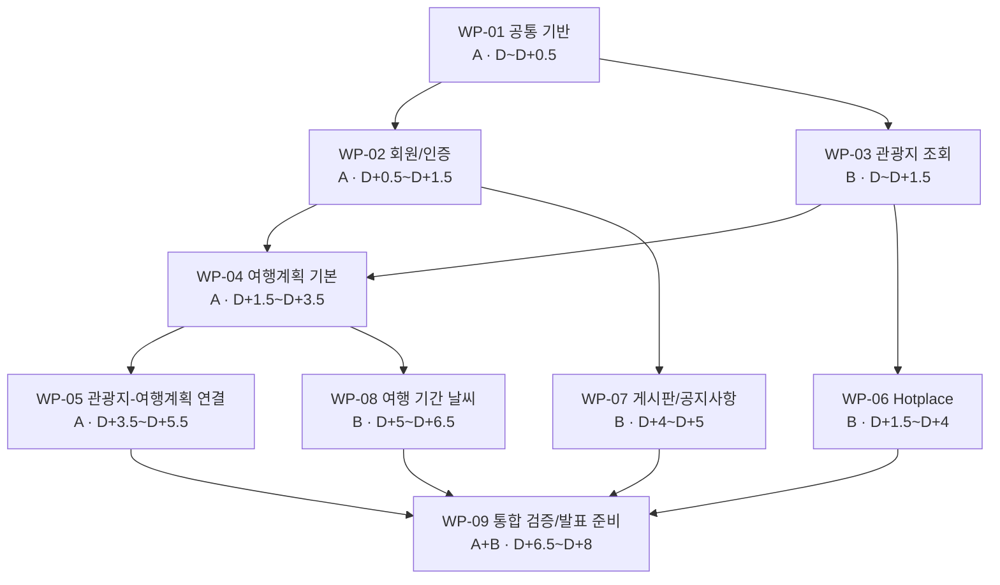
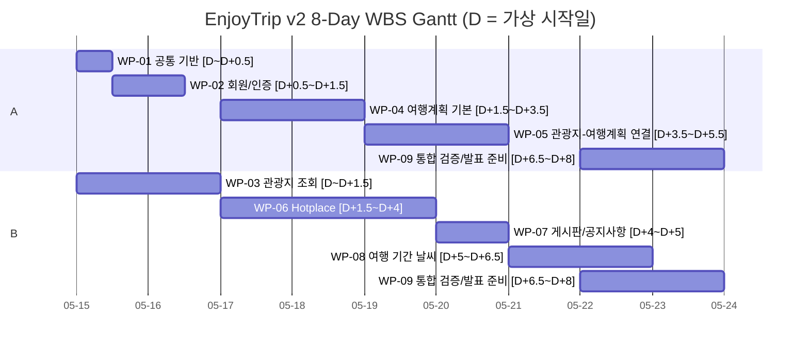

# EnjoyTrip v2 WBS

## 1. 목적

이 문서는 EnjoyTrip v2 기능 명세와 구현 범위를 WBS 수준으로 정리한다. 기존 Spring Boot + MyBatis 구조를 기준으로, 구현 대상 기능을 작업 패키지 단위로 나눈다.

뉴스 크롤링 요구사항(F06)은 이번 WBS 범위에서 제외한다.

## 2. 전제

- Backend는 Java 17, Spring Boot 3, Spring MVC, MyBatis를 사용한다.
- View는 JSP, JSTL, Vanilla JavaScript를 유지한다.
- DB는 MySQL 8과 `sql/schema.sql`을 기준으로 한다.
- 관광지 정보는 한국관광공사 KorService2 API를 사용한다.
- 지도는 Kakao Maps JavaScript API를 사용한다.
- 인증은 `HttpSession`의 `loginUser`, `loginUserName`을 사용한다.
- 날씨 API 제공자는 WBS 단계에서 특정하지 않는다.

## 3. 기능적 요구사항

| 번호 | 분류 | 요구사항명 | 요구사항 상세 | 우선순위 |
|------|------|------------|---------------|----------|
| F01 | 여행 | 지역별 관광지 정보 수집 | 한국관광공사 지역별 관광지 정보를 얻어와 화면에 표시 | 필수 |
| F02 | 여행 | 관광지, 숙박, 음식점 조회 | 관광지 정보를 지역별 원하는 컨텐츠별 조회 | 필수 |
| F03 | 여행 | 문화시설, 공연, 여행코스, 쇼핑 조회 | 관광지 정보를 지역별 원하는 컨텐츠별 조회 | 필수 |
| F04 | 여행 | 여행 계획 경로 설정 | 조회한 관광지를 활용하여 여행 계획, 여행 경로를 저장 | 필수 |
| F05 | 여행 | 회원 주도의 hotplace 등록 | 지도와 사진을 활용한 hotplace 등록 | 필수 |
| F06 | 여행 | 관광지 관련 뉴스 정보 크롤링 | 이번 WBS 범위에서 제외 | 제외 |
| F07 | 회원 | 회원 관리 | 회원가입, 수정, 조회, 탈퇴 | 필수 |
| F08 | 회원 | 로그인 관리 | 로그인, 로그아웃, 비밀번호 찾기 | 필수 |
| F09 | 회원 | 공지사항 | 공지사항 등록, 수정, 삭제, 조회 | 필수 |
| F10 | 여행 | 공유게시판 | 게시판 등록, 수정, 삭제, 조회 | 필수 |
| F11 | 여행 | 관광지 날씨 | 관광지의 기간별 날씨 출력 | 추가 |

## 4. 요구사항 추적표

| 요구사항 | WBS 작업 패키지 | 주요 산출물 |
|----------|----------------|-------------|
| F01 | WP-03 | 관광지 API client, 지역별 조회 화면 |
| F02 | WP-03 | 관광지/숙박/음식점 컨텐츠 필터, 검색 결과 목록/지도 |
| F03 | WP-03 | 문화시설/공연/여행코스/쇼핑 컨텐츠 필터, 검색 결과 목록/지도 |
| F04 | WP-04, WP-05 | 여행계획 CRUD, 방문지 저장, 경로 지도, 관광지 검색 결과에서 계획 추가 |
| F05 | WP-06 | Hotplace CRUD, 이미지 업로드, 지도 좌표 등록, 관광지 content_id 연결 |
| F06 | 제외 | 이번 WBS 범위에서 구현하지 않음 |
| F07 | WP-02 | 회원가입, 회원정보 조회/수정, 회원 탈퇴 |
| F08 | WP-02 | 로그인, 로그아웃, 비밀번호 찾기 |
| F09 | WP-07 | 공지사항 CRUD, 권한 처리 |
| F10 | WP-07 | 공유게시판 CRUD, 권한 처리 |
| F11 | WP-08 | 여행 기간 날씨 service, 날씨 API adapter, 계획 상세 날씨 영역 |

## 5. WBS 개요

| WBS ID | 작업 패키지 | 설명 | 우선순위 | 선행 작업 |
|--------|-------------|------|----------|-----------|
| WP-01 | 공통 기반 | 환경설정, 예외, 인증, 로깅, 테스트 실행 기준 점검 | 필수 | 없음 |
| WP-02 | 회원/인증 | 회원관리, 로그인/로그아웃, 비밀번호 찾기 | 필수 | WP-01 |
| WP-03 | 관광지 조회 | 지역/컨텐츠 기반 관광지 조회와 Kakao Map 표시 | 필수 | WP-01 |
| WP-04 | 여행계획 기본 | 여행계획 CRUD, 방문지 저장, 경로 표시, 순서 변경 | 필수 | WP-02, WP-03 |
| WP-05 | 관광지-여행계획 연결 | 검색 결과 포함 여부 자동 표시, 상세보기/추가 action 분리, 추가 modal | 필수 | WP-04 |
| WP-06 | Hotplace | Hotplace CRUD, 이미지 업로드, 관광지 content_id 연결, 상세 후기 표시 | 필수 | WP-02, WP-03 |
| WP-07 | 게시판/공지사항 | 공지사항과 공유게시판 CRUD, 작성자 권한 검증 | 필수 | WP-02 |
| WP-08 | 여행 기간 날씨 | 여행계획 기간 기반 날짜별 날씨 표시 | 추가 | WP-04 |
| WP-09 | 통합 검증/발표 준비 | 전체 테스트, 수동 시나리오 검증, README/명세 정리 | 필수 | WP-01~WP-08 |

## 6. 상세 WBS

### WP-01. 공통 기반

| ID | 작업 | 상세 내용 | 산출물 |
|----|------|-----------|--------|
| WP-01-01 | 실행 환경 점검 | `.env`, Docker DB, Maven wrapper 실행 기준 확인 | 실행 가이드 |
| WP-01-02 | 공통 처리 점검 | 예외 처리, 인증 인터셉터, 요청 로깅, 테스트 러너 기준 확인 | 공통 기준 |

### WP-02. 회원/인증

| ID | 작업 | 상세 내용 | 산출물 |
|----|------|-----------|--------|
| WP-02-01 | 회원 관리 | 회원가입, 조회, 수정, 탈퇴 | 회원 화면/처리 |
| WP-02-02 | 로그인 관리 | 로그인, 로그아웃, 비밀번호 찾기 | 인증 화면/처리 |
| WP-02-03 | 회원/인증 테스트 | 회원 service, mapper, controller 테스트 | 테스트 코드 |

### WP-03. 관광지 조회

| ID | 작업 | 상세 내용 | 산출물 |
|----|------|-----------|--------|
| WP-03-01 | 관광지 API | 시도/구군과 컨텐츠별 관광지 조회 | Attraction API |
| WP-03-02 | 관광지 조회 화면 | Kakao Map, 검색 결과 목록, 상세 이동 | 관광지 조회 JSP |
| WP-03-03 | 관광지 상세 | 이미지, 주소, 전화, 개요, 지도 표시 | 관광지 상세 JSP |
| WP-03-04 | 관광지 테스트 | API client, controller, JSP route 테스트 | 테스트 코드 |

### WP-04. 여행계획 기본

| ID | 작업 | 상세 내용 | 산출물 |
|----|------|-----------|--------|
| WP-04-01 | 여행계획 CRUD | 목록, 작성, 상세, 수정, 삭제 | 여행계획 화면 |
| WP-04-02 | 방문지/경로 관리 | 방문지 저장, 지도 경로 표시, 순서 변경 | 계획 상세 기능 |
| WP-04-03 | 권한/테스트 | 소유자 검증과 service/controller/mapper 테스트 | 테스트 코드 |

### WP-05. 관광지-여행계획 연결

| ID | 작업 | 상세 내용 | 산출물 |
|----|------|-----------|--------|
| WP-05-01 | 포함 여부 API | 여행계획 상태 계산, 관광지 포함 여부 조회, 관광지 추가 API | Plan API |
| WP-05-02 | 검색 결과 UX | 포함 계획 수, `[상세보기]`, `[여행계획에 추가]` 표시 | 관광지 조회 JSP/JS |
| WP-05-03 | 추가/상세 UX | 추가 modal, 중복/지난 계획 비활성화, 상세 포함 정보 표시 | modal, 상세 JSP/JS |
| WP-05-04 | 연결 UX 테스트 | 중복 추가 방지, 포함 정보 표시, modal 동작 테스트 | 테스트 코드 |

### WP-06. Hotplace

| ID | 작업 | 상세 내용 | 산출물 |
|----|------|-----------|--------|
| WP-06-01 | Hotplace CRUD/업로드 | 목록, 상세, 작성, 수정, 삭제, 이미지 업로드, 좌표 저장 | Hotplace 화면 |
| WP-06-02 | 관광지 연결 | `hotplace.content_id` 추가, 관광지 상세에서 등록 폼 prefill | DB schema, 등록 흐름 |
| WP-06-03 | Hotplace 요약 | 관광지 상세에 등록 수, 사진 후기 수, 최근 후기 표시 | summary API/JSP |
| WP-06-04 | Hotplace 테스트 | contentId 연결, summary, 파일 업로드, 권한 테스트 | 테스트 코드 |

### WP-07. 게시판/공지사항

| ID | 작업 | 상세 내용 | 산출물 |
|----|------|-----------|--------|
| WP-07-01 | 게시판 CRUD | 공지사항과 공유게시판 등록, 수정, 삭제, 조회 | 게시판 화면 |
| WP-07-02 | 게시판 부가 처리 | 조회수 증가, 작성자 권한 검증 | 권한/조회수 처리 |
| WP-07-03 | 게시판 테스트 | service, controller, mapper 테스트 | 테스트 코드 |

### WP-08. 여행 기간 날씨

| ID | 작업 | 상세 내용 | 산출물 |
|----|------|-----------|--------|
| WP-08-01 | 날씨 service/API | 날짜별 날씨 DTO, 위치 기준 계산, 외부 API adapter | Weather module |
| WP-08-02 | 계획 상세 날씨 UI | 여행계획 기간별 날씨와 안내 문구 표시 | plan/detail.jsp |
| WP-08-03 | 날씨 테스트 | 위치 선택, 범위 밖 날짜, API 실패 테스트 | 테스트 코드 |

### WP-09. 통합 검증/발표 준비

| ID | 작업 | 상세 내용 | 산출물 |
|----|------|-----------|--------|
| WP-09-01 | 자동/패키징 검증 | 전체 테스트와 WAR package 검증 | 테스트/빌드 결과 |
| WP-09-02 | 수동 시나리오 검증 | 핵심 사용자 흐름 검증 | 검증 체크리스트 |
| WP-09-03 | 문서/데모 정리 | README, 명세, 데모 데이터 정리 | 문서/데모 시나리오 |

## 7. 주요 의존관계

```text
WP-01 공통 기반
-> WP-02 회원/인증
-> WP-03 관광지 조회
-> WP-04 여행계획 기본
-> WP-05 관광지-여행계획 연결

WP-03 관광지 조회
-> WP-06 Hotplace

WP-04 여행계획 기본
-> WP-08 여행 기간 날씨

WP-01~WP-08
-> WP-09 통합 검증/발표 준비
```

## 8. 우선 구현 순서

1. WP-01 공통 기반
2. WP-02 회원/인증
3. WP-03 관광지 조회
4. WP-04 여행계획 기본
5. WP-05 관광지-여행계획 연결
6. WP-06 Hotplace
7. WP-07 게시판/공지사항
8. WP-08 여행 기간 날씨
9. WP-09 통합 검증/발표 준비

## 9. 리스크와 대응

| 리스크 | 영향 | 대응 |
|--------|------|------|
| 외부 관광 API 장애 또는 quota 제한 | 관광지 조회 실패 | 서버 사이드 예외 처리, 실패 안내 UI, MockWebServer 테스트 |
| Kakao Map 키/도메인 설정 오류 | 지도 미표시 | 지도 fallback 메시지, README 설정 문서화 |
| 날씨 API 예보 기간 제한 | 먼 미래 여행 날씨 미표시 | 예보 가능 범위 밖 안내 문구 표시 |
| 여행계획 중복 추가 | 데이터 중복/UX 혼란 | contentId + planId 기준 중복 검증, modal 비활성화 |
| Hotplace와 관광지 연결 누락 | 상세 후기 집계 불가 | 관광지 상세에서 등록하는 Hotplace는 contentId 필수 전달 |

## 10. 수동 검증 시나리오

1. 회원가입 후 로그인한다.
2. 관광지 조회에서 부산/해운대구/관광지를 검색한다.
3. 관광지 상세를 확인한다.
4. 여행계획을 생성한다.
5. 관광지 검색 결과에서 `[여행계획에 추가]`를 눌러 생성한 계획에 추가한다.
6. 같은 관광지를 다시 추가하려고 할 때 이미 포함된 계획이 비활성화되는지 확인한다.
7. 여행계획 상세에서 방문지와 경로가 표시되는지 확인한다.
8. 여행계획 상세에서 여행 기간 날씨가 표시되는지 확인한다.
9. 관광지 상세에서 `[이 명소를 핫플레이스로 등록]`을 눌러 사진과 후기를 등록한다.
10. 관광지 상세에서 Hotplace 등록 수, 사진 후기 수, 최근 후기가 표시되는지 확인한다.
11. 공지사항과 공유게시판 글을 작성, 수정, 삭제한다.

## 11. 다음 산출물

- 기능 명세서: F01~F05, F07~F11 상세 시나리오, actor, precondition, postcondition
- 화면 설계서: 관광지 조회, 관광지 상세, 여행계획 상세, Hotplace 등록, 날씨 영역
- API 명세서: `/api/attractions/**`, `/api/plans/**`, Hotplace summary, weather
- DB 설계서: `hotplace.content_id`, weather cache 필요 여부
- 구현 계획서: WBS 작업 패키지별 TDD 기반 implementation plan

## 12. WBS 시각화

### 12.1 역할 배정

| 담당자 | 주 담당 영역 |
|--------|--------------|
| A | 공통 기반, 회원/인증, 여행계획, 관광지-여행계획 연결, 통합 검증 |
| B | 관광지 조회, Hotplace, 게시판/공지사항, 날씨, 통합 검증 |

### 12.2 WBS 의존관계



### 12.3 8일 작업 일정

Mermaid `gantt`는 실제 날짜 형식을 요구하므로, 아래 차트는 `D = 2026-05-15`라는 가상 기준일을 사용한다. 일정 해석은 실제 날짜가 아니라 `D`, `D+1`, `D+2` 상대 일정으로 본다.



상대 일정표:

| 기간 | A 작업 | B 작업 |
|------|--------|--------|
| D ~ D+0.5 | WP-01 공통 기반 | WP-03 관광지 조회 시작 |
| D+0.5 ~ D+1.5 | WP-02 회원/인증 | WP-03 관광지 조회 |
| D+1.5 ~ D+3.5 | WP-04 여행계획 기본 | WP-06 Hotplace |
| D+3.5 ~ D+4 | WP-05 관광지-여행계획 연결 시작 | WP-06 Hotplace 마무리 |
| D+4 ~ D+5 | WP-05 관광지-여행계획 연결 | WP-07 게시판/공지사항 |
| D+5 ~ D+6.5 | WP-05 마무리/연동 테스트 | WP-08 여행 기간 날씨 |
| D+6.5 ~ D+8 | WP-09 통합 검증/발표 준비 | WP-09 통합 검증/발표 준비 |
