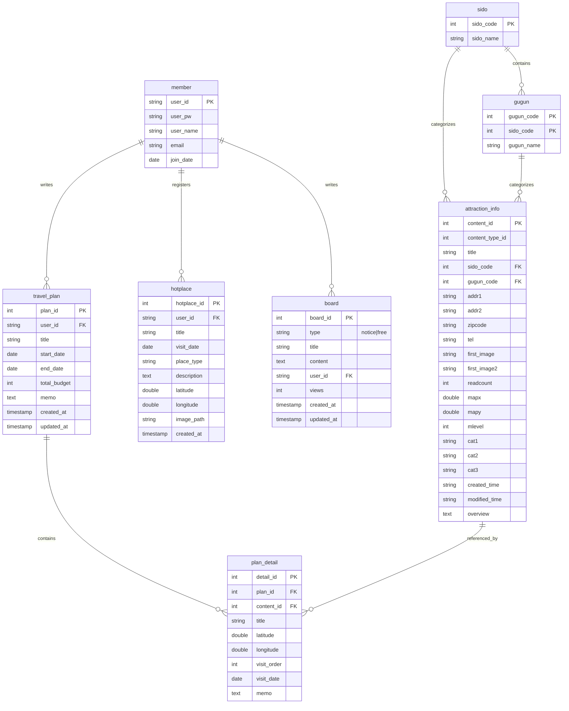

# EnjoyTrip ERD

`sql/schema.sql` 파일을 바탕으로 작성된 데이터베이스 스키마 구조입니다.

## 테이블 상세 설명

1.  **member (회원)**: 사용자 계정 정보를 관리합니다.
2.  **sido (시도)**: 지역 코드(광역시/도)를 관리합니다.
3.  **gugun (구군)**: 시도에 속한 하위 행정구역 코드를 관리합니다.
4.  **attraction_info (관광지 정보)**: 공공데이터 API로부터 가져온 관광지 상세 정보를 저장합니다.
5.  **travel_plan (여행 계획)**: 사용자가 생성한 여행 계획의 마스터 정보입니다.
6.  **plan_detail (여행 계획 상세)**: 여행 계획에 포함된 개별 방문지 정보를 저장합니다.
7.  **hotplace (핫플레이스)**: 사용자가 직접 등록한 추천 장소 정보입니다.
8.  **board (게시판)**: 공지사항 및 자유게시판 게시글을 관리합니다.
