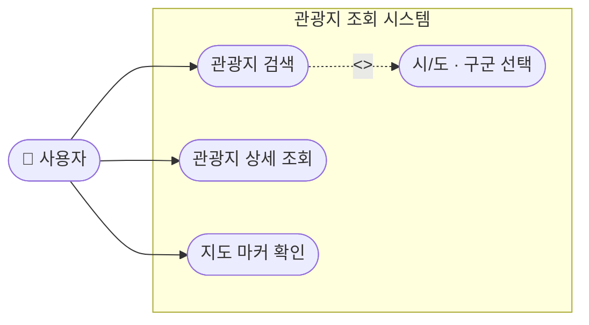
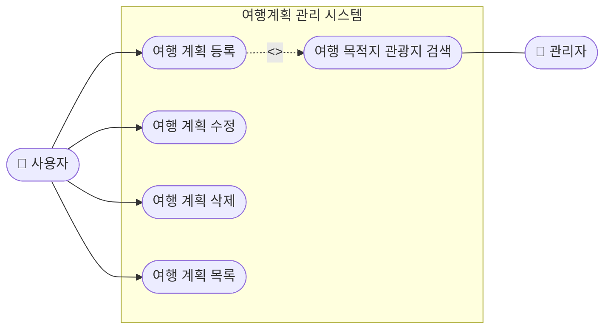
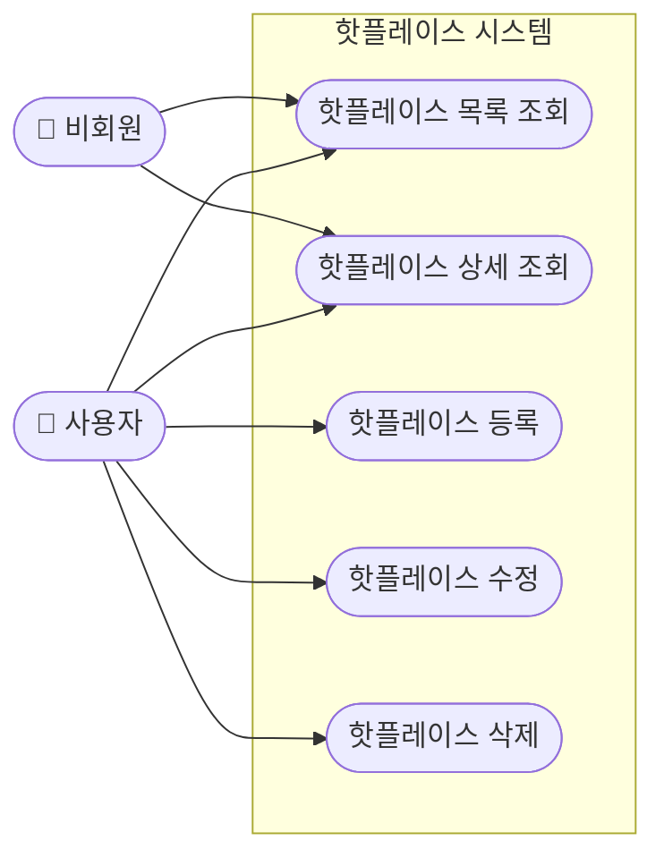
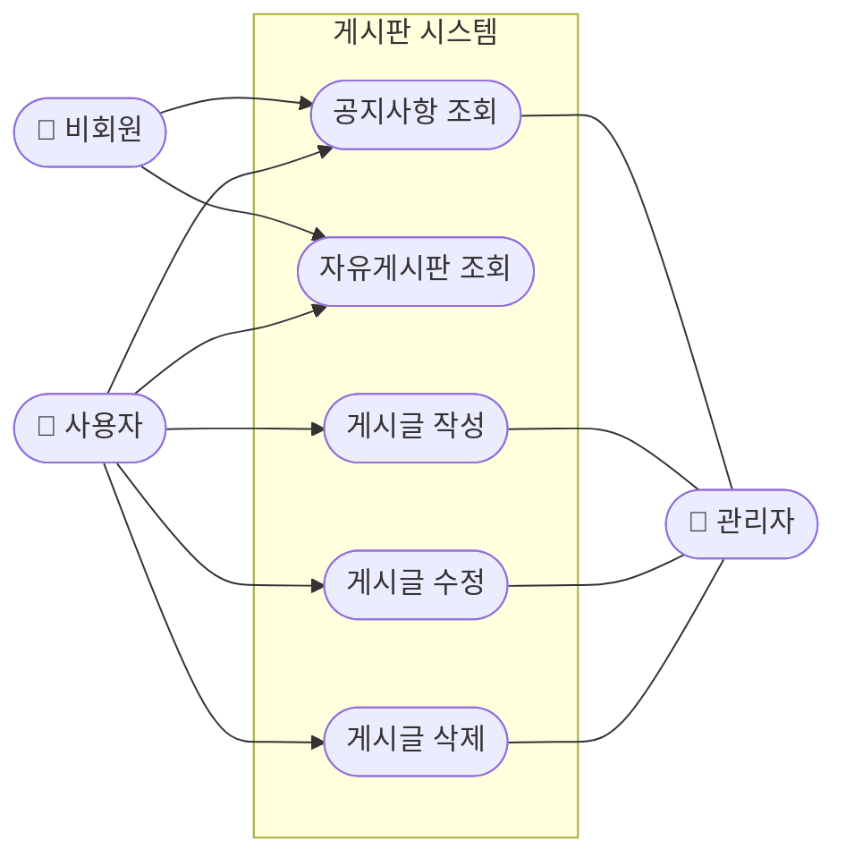
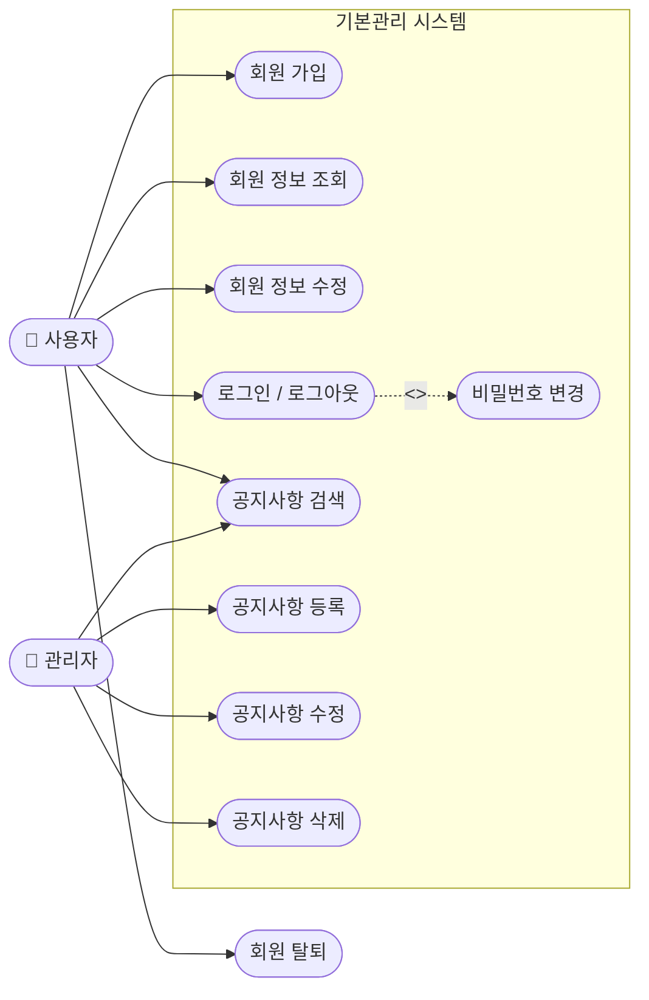

# EnjoyTrip 유스케이스 다이어그램

---

## 그림 1 · 관광지 조회 Usecase (F101~103)

---

## 그림 2 · 여행계획 관리 Usecase (F104)

---

## 그림 3 · 핫플레이스 Usecase (F105)

---

## 그림 4 · 게시판 Usecase (F106)

---

## 그림 5 · 기본관리 Usecase (F107~108)

